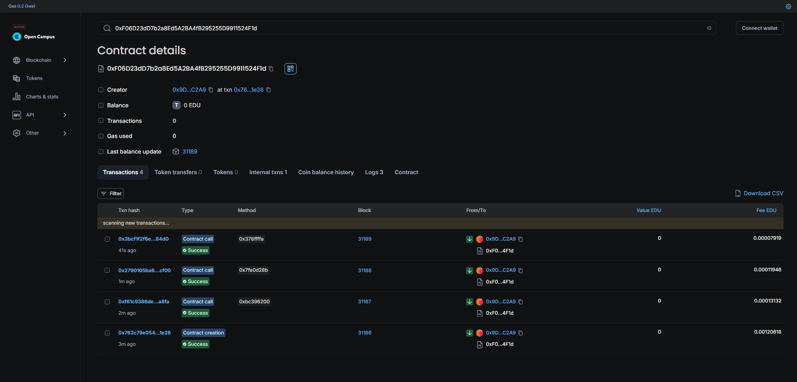

# Admission Management System

## Project Description

The Admission Management System is a blockchain-based platform designed to manage student admissions in a transparent, secure, and decentralized manner. Leveraging Ethereum smart contracts, this system enables an admin to efficiently manage student records, including adding, updating, and maintaining their admission statuses. All records are securely stored on the blockchain, ensuring immutability and accessibility.


## Vision

The vision for this project is to revolutionize the management of student admissions by utilizing blockchain technology to ensure:

1. **Transparency**: Every administrative action is recorded on the blockchain, providing a clear audit trail.
2. **Security**: Student data is protected against unauthorized access and tampering through blockchain's immutable ledger.
3. **Efficiency**: Streamline the administrative processes related to student admissions, reducing the likelihood of errors and administrative overhead.
4. **Global Accessibility**: Provide an innovative solution that can be adopted by educational institutions around the world.

## Flowchart

```plaintext
[Start]
    |
    v
[Admin Logs In]
    |
    v
[Admin Actions]
    |-----> [Add Student]
    |            |
    |            v
    |        [Update Student]
    |            |
    |            v
    |        [Change Admission Status]
    |
    v
[Actions Recorded on Blockchain]
    |
    v
[Events Emitted]
    |
    v
[End]
```

## Contract Address

The current deployment of the Admission Management System contract is at:

0xF06D23dD7b2a8Ed5A2BA4fB295255D9911524F1d



## Future Scope

1. **Enhanced User Interface**: Develop a web or mobile application to interact with the smart contract for a user-friendly experience.
2. **Role-Based Access Control**: Implement additional roles and permissions for more granular control over administrative functions.
3. **Integration with Educational Systems**: Extend functionality to integrate with existing educational management systems for a seamless experience.
4. **Automated Notifications**: Add features for automated email or SMS notifications related to student admission changes.


## Contact Details

For more information or inquiries about the Admission Management System, please contact:

**Name :** Aisrang Debbarma

**Email :** aisrangdb@gmail.com

**LinkedIn :** https://www.linkedin.com/in/aisrang-debbarma-444467324/

**GitHub :** https://github.com/Aisrang